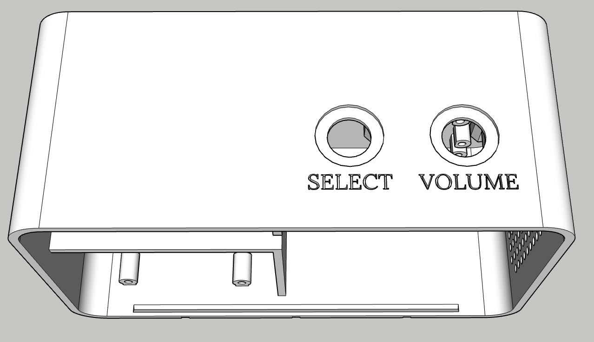
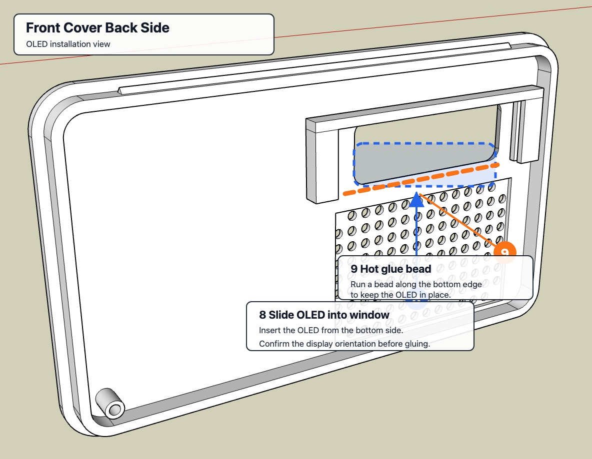
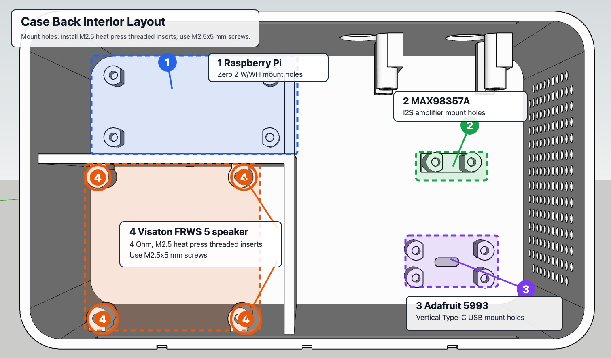
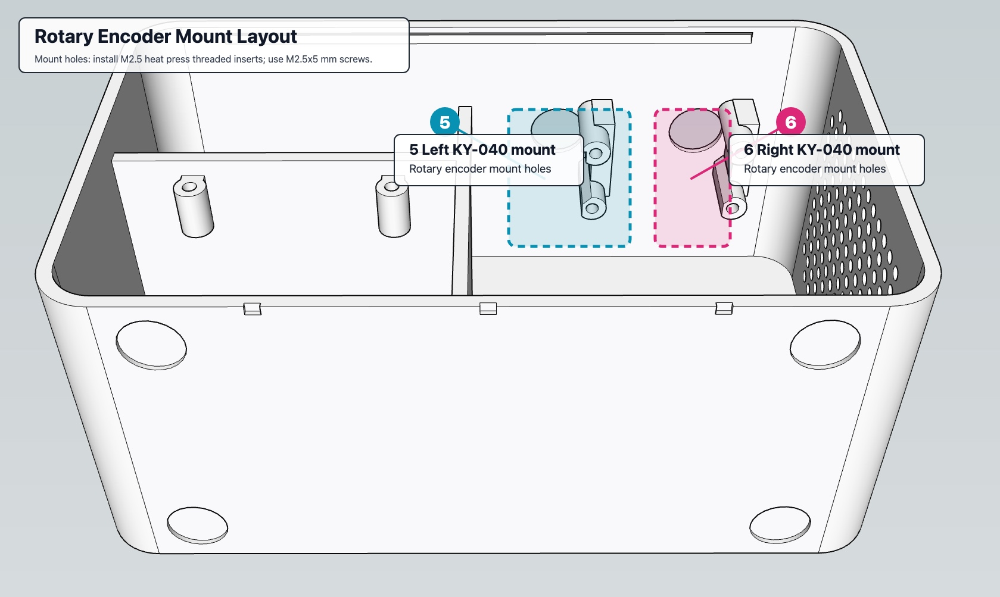

# Chapter Case

Printable STL files for the Chapter Player enclosure.

## Files

- [stl/chapter-case-front-v5.stl](stl/chapter-case-front-v5.stl) - front case shell
- [stl/chapter-case-back-v5.stl](stl/chapter-case-back-v5.stl) - back case shell
- [stl/chapter-case-knob-v5.stl](stl/chapter-case-knob-v5.stl) - rotary encoder knob

## Assembly Diagrams

- [case-top-select-volume-reference.png](case-top-select-volume-reference.png) - CAD reference showing the top of the case and the `SELECT` and `VOLUME` labels
- [case-front-cover-backside-oled-layout.jpg](case-front-cover-backside-oled-layout.jpg) - annotated CAD view of the back side of the front cover showing OLED installation
- [case-back-interior-layout.jpg](case-back-interior-layout.jpg) - annotated CAD view into the case back showing heat press insert bosses and hardware mounting areas
- [case-rotary-encoder-mount-layout.jpg](case-rotary-encoder-mount-layout.jpg) - annotated CAD view from the x=0/front-side angle showing the two KY-040 rotary encoder mounts

Use this CAD view as the reference for the top of the finished case. The left opening is labeled `SELECT` and the right opening is labeled `VOLUME`, matching the control names used throughout the Chapter documentation.

In the front cover back-side diagram, blue `8` marks the OLED window. Slide the OLED into the window from the bottom. After you confirm the OLED is in the correct orientation, run a small bead of hot glue along the bottom edge, marked in orange as `9`, to keep it in place.

The small hole at the lower-right of the front cover, as viewed from the outside, is for the 3 mm warm-white power indicator LED. Insert the LED into the hole from the back of the cover and secure it with a small dab of hot glue. The build uses the 5-6 V [Dioramo 13240](https://dioramo.com/products/13240); see the [install guide](../../docs/raspberry-pi-zero-2w-install.md#power-indicator-led) for its power wiring.

In the diagram, orange `4` marks the speaker mounting bosses for a Visaton FRWS 5 - 4 Ohm speaker. Install M2.5 heat press threaded inserts in the highlighted mounting holes and use M2.5x5 mm screws for mounting components.

In the rotary encoder diagram, `5` and `6` mark the KY-040 module mounts for the Select and Volume knobs on the inner front wall.

Orange `7` marks the bottom foot indents. Install polyurethane adhesive feet in those indents; the build uses [Amazon ASIN B074PXV3D8](https://www.amazon.com/dp/B074PXV3D8?th=1).

The annotated JPGs use the CAD screenshots in [images/](images/) as their source views.

## Installing The Front Cover

Treat the front cover as the final assembly step. Before installing it, complete the wiring and software tests and confirm that the display, Select knob, Volume knob, speaker, power indicator, Wi-Fi, and playback all work correctly.

1. Arrange the internal wiring so no wire can be pinched between the front cover and the back of the case.
2. Place the front cover over the back of the case and align their edges.
3. Start at either the left or right side; engaging one side first is easier than trying to snap the entire cover into place at once.
4. Work around the perimeter with even hand pressure until the remaining tabs snap into place.
5. Check that the seam is even and fully seated on every side.

If a section is difficult to insert, a thin plastic spudger or similar non-marring tool can provide gentle leverage between the cover and the back of the case. Do not force the cover, use a metal screwdriver, or pry near wiring and printed snap tabs; stop and check alignment or trapped wires instead.

## Notes

These files are provided as the v5 case export. They are intended for the Raspberry Pi Zero 2 W/WH build described in the main install guide.

The exact print orientation, supports, material, and slicer settings may depend on your printer. If you remix the case, STEP or source CAD files are especially helpful for other builders.
