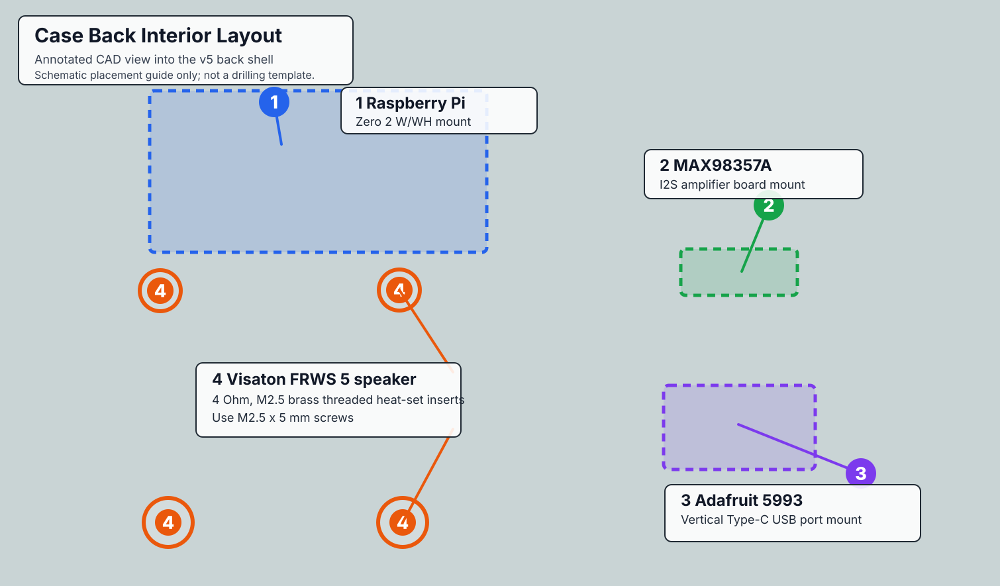
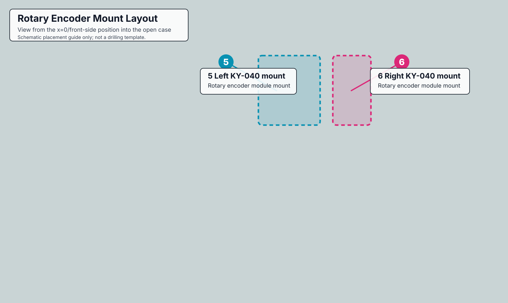

# Chapter Case

Printable STL files for the Chapter Player enclosure.

## Files

- [stl/chapter-case-front-v5.stl](stl/chapter-case-front-v5.stl) - front case shell
- [stl/chapter-case-back-v5.stl](stl/chapter-case-back-v5.stl) - back case shell
- [stl/chapter-case-knob-v5.stl](stl/chapter-case-knob-v5.stl) - rotary encoder knob

## Assembly Diagram

- [case-back-interior-layout.svg](case-back-interior-layout.svg) - annotated CAD view into the case back showing heat-set insert bosses and hardware mounting areas
- [case-rotary-encoder-mount-layout.svg](case-rotary-encoder-mount-layout.svg) - annotated CAD view from the x=0/front-side angle showing the two KY-040 rotary encoder mounts

In the diagram, orange `4` marks the speaker mounting bosses for a Visaton FRWS 5 - 4 Ohm speaker. Use M2.5 brass threaded heat-set inserts with M2.5 x 5 mm screws for those speaker mounts.

In the rotary encoder diagram, `5` and `6` mark the two KY-040 rotary encoder module mounts on the inner front wall.

The annotated SVGs use the CAD screenshots in [images/](images/) as their source views.

## Notes

These files are provided as the v5 case export. They are intended for the Raspberry Pi Zero 2 W/WH build described in the main install guide.

The exact print orientation, supports, material, and slicer settings may depend on your printer. If you remix the case, STEP or source CAD files are especially helpful for other builders.
